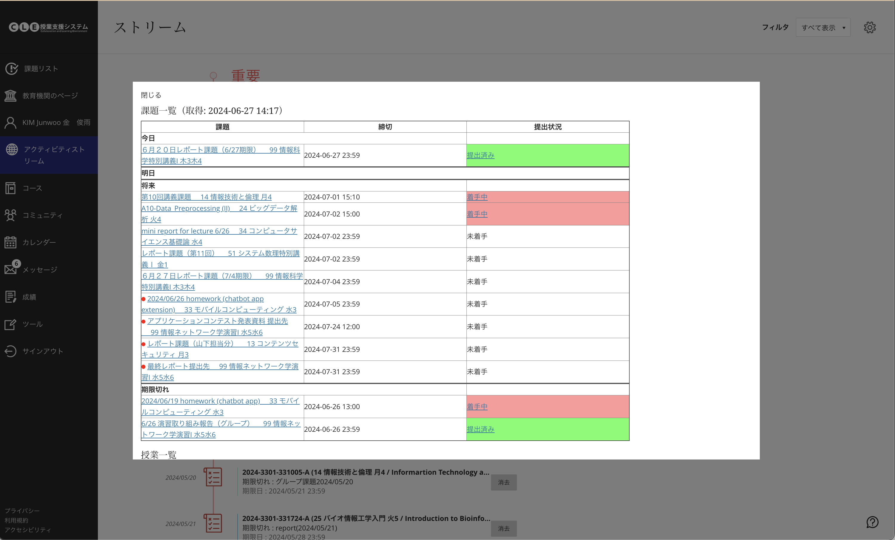

# リファクタリング元
https://github.com/TatsukiNishimura/add-assignmentList-extension

# 追加機能

- 左のメニューバーに「課題リスト」アイコンを追加
- アイコンからポップアップで課題状況を確認できるように
- 新規課題に赤色バッジがつく
- 着手中/提出済み課題はリンクを押すと確認できる

# 使い方
- 「Download Zip」または git clone でローカルにコピー
- [chrome://extensions/](chrome://extensions/) にアクセス -> デベロッパーモードをオン -> \
パッケージ化されていない拡張機能を読み込む -> 「add-assignmentList-extension-master_debug」を選択